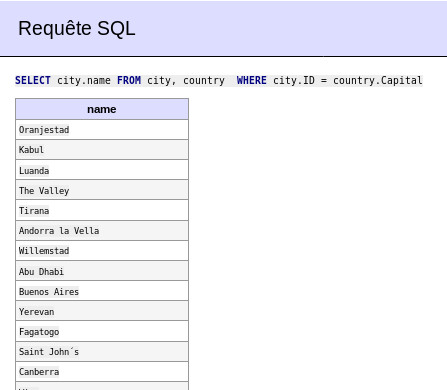

---
author:
- Nicolas Vadkerti
title: Stockage de Données avec base de données MySQLd
---

<https://github.com/SlaynPool/CR_BDD/>

Préparation (Installation des outils)
=====================================

Suite au passage à Debian 10, PHPmyAdmin n'est plus disponnible via les
depots de APT, de ce fais, j'ai décidé d'utiliser Adminer, un
gestionnaire de DATABASE equivalent, qui a la force d'etre qu'un seul
fichier PHP donc très simple de déploiment.

-   ``` {#commande/1.txt .default caption="Installation de Adminer" label="commande/1.txt" style="Style1"}
    #Installation
    apt install apache2 php mariadb-server mariadb

    #ADMINER
    wget https://github.com/vrana/adminer/releases/download/v4.7.3/adminer-4.7.3.php
    mkdir /var/www/html/adminer
    mv adminer-4.7.3.php /var/www/html/adminer/adminer.php
    chmod 755 /var/www/html/adminer/adminer.php
    chown -R www-data:www-data /var/www/html/adminer
    ```

Mise en jambes
==============

Analyse de la base de test
--------------------------

### Analyser la nature de la base. Combien y a-t-il de tables dans la base?

La base a pour but de stocker des informations sur des pays, On peut
voir qu'il ya trois tables dans la base :

-   ``` {#commande/2.txt .default caption="SHOW TABLES" label="commande/2.txt" style="Style1"}
    MariaDB [(none)]> USE world
    Reading table information for completion of table and column names
    You can turn off this feature to get a quicker startup with -A

    Database changed
    MariaDB [world]> SHOW TABLES
        -> ;
    +-----------------+
    | Tables_in_world |
    +-----------------+
    | city            |
    | country         |
    | countrylanguage |
    +-----------------+
    3 rows in set (0.001 sec)
    ```

### Quelles sont les clefs primaire et secondaire des tables

Si l'on prend l'exemple de la table city :

-   ``` {#commande/3.txt .default caption="SELECT * FROM city;" label="commande/3.txt" style="Style1"}
    MariaDB [world]> SELECT * FROM city;
    +------+------------------------------------+-------------+------------------------+------------+
    | ID   | Name                               | CountryCode | District               | Population |
    +------+------------------------------------+-------------+------------------------+------------+
    |    1 | Kabul                              | AFG         | Kabol                  |    1780000 |
    |    2 | Qandahar                           | AFG         | Qandahar               |     237500 |
    |    3 | Herat                              | AFG         | Herat                  |     186800 |
    |    4 | Mazar-e-Sharif                     | AFG         | Balkh                  |     127800 |
    |    5 | Amsterdam                          | NLD         | Noord-Holland          |     731200 |
    |    6 | Rotterdam                          | NLD         | Zuid-Holland           |     593321 |
    ```

La pkey est ID , et les clés secondaires sont : Name, CountryCode,
District, Population. Cependant, les autres tables ont pour pkey : Code
pour country et CountryCode et language pour countrylanguage

Requetes de Base
----------------

### Donner la liste de toutes les villes françaises

![Notre requete
SQL'[]{label="fig:paquet"}](ressource/1.jpg){#fig:paquet}

### Récupérer la liste de toutes les capitales.

Pour cette question j'ai trouvé deux solutions :

![Solution 2[]{label="fig:paquet"}](ressource/2.jpg){#fig:paquet}



### Combien y a-t-il de pays dans la base ? 

-   ``` {#commande/5.txt .default caption="count()" label="commande/5.txt" style="Style1"}
    MariaDB [world]> SELECT count(Code) FROM country 
        -> ;
    +-------------+
    | count(Code) |
    +-------------+
    |         239 |
    +-------------+
    1 row in set (0.000 sec)

    ```

### Donner les villes dont la population est supérieure à 1 million d'habitants. Combien de villescorrespondent à ce critère?

-   ``` {#commande/6.txt .default caption="Requetes" label="commande/6.txt" style="Style1"}
    MariaDB [world]> SELECT city.name  FROM city WHERE city.Population>1000000
        -> ;
    +--------------------------+
    | name                     |
    +--------------------------+
    | Kabul                    |
    | Alger                    |
    | Luanda                   |
    | Buenos Aires             |
    | La Matanza               |
    | Cordoba                  |
    | Yerevan                  |
    | Sydney                   |
    | Melbourne                |
    | Brisbane                 |
    | Perth                    |
    ----------------------------------------------------------------
    MariaDB [world]> SELECT count(city.name)  FROM city WHERE city.Population>1000000
        -> ;
    +------------------+
    | count(city.name) |
    +------------------+
    |              237 |
    ```
